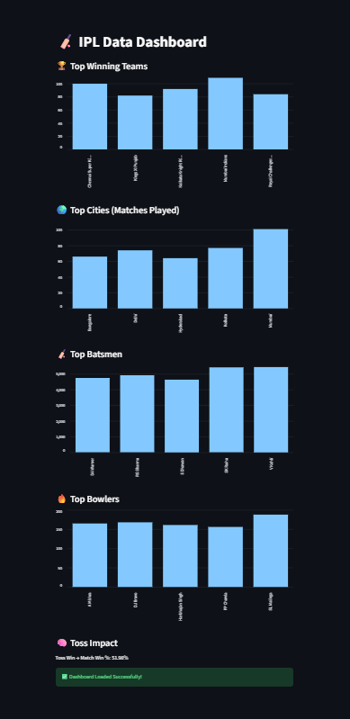

# 🏏 IPL Data Analysis Dashboard

This project analyzes IPL (Indian Premier League) cricket data and presents meaningful insights using Python and Streamlit. The dashboard visualizes team performance, player statistics, and match trends in an interactive way.

---

## 📊 Features

* 🏆 Top Winning Teams
* 🌍 Top Cities Hosting Matches
* 🏏 Top Batsmen Analysis
* 🔥 Top Bowlers Analysis
* 🧠 Toss Impact on Match Results

---

## 📸 Dashboard Preview



---

## 🌐 Live Dashboard

👉 https://cricket-analysis-project-dtj57e8uwdfxdrdjdqmtm6.streamlit.app/

---

## 🛠️ Technologies Used

* Python
* Pandas
* Streamlit
* Matplotlib

---

## ▶️ How to Run Locally

1. Install required libraries:

```bash
python -m pip install pandas matplotlib streamlit
```

2. Run the dashboard:

```bash
python -m streamlit run dashboard.py
```

---

## 📁 Project Structure

```
Cricket-analysis-project/
│── analysis.py
│── dashboard.py
│── matches.csv
│── deliveries.csv
│── dashboard-preview.png
│── README.md
```

---

## 🚀 Future Improvements

* Add filters for team and player selection
* Enhance UI with better design
* Add advanced metrics (strike rate, economy rate)
* Include more interactive charts

---

## ⭐ Project Highlights

This project demonstrates:

* Data Cleaning & Analysis
* Data Visualization
* Dashboard Development
* Deployment using Streamlit Cloud

---

💡 This is a beginner-to-intermediate level data science project that showcases real-world application of Python in sports analytics.
